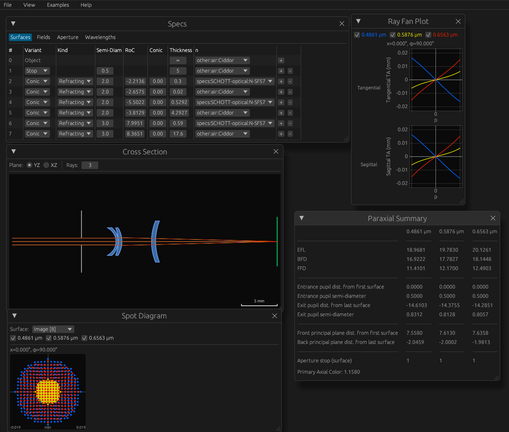

# Cherry Ray Tracer

Interactive and accessible optical system design for tabletop optics.

*This software is in development and has not yet stabilized. Do not expect backwards compatibility with previously-saved designs.*

## Table of Contents

1. [Quickstart](#quickstart)
1. [Getting Help](#getting-help)
1. [Project Description](#project-description)
1. [Roadmap](#roadmap)
1. [License](#license)

## Quickstart

1. Go to <https://kmdouglass.github.io/cherry/>.
1. Select one of the examples from the menu at the top of the screen.
1. Open one or more of the output windows such as the spot diagram or paraxial summary.
1. Vary any of the specs, such as surface radius of curvature, and watch the outputs change.

## Getting Help

### Q&A, Feature Requests, and Bug Reports

If you have a question about how to use Cherry, then please do not hesitate to [start a Q&A discussion](https://github.com/kmdouglass/cherry/discussions/new?category=q-a). [Feature requests](https://github.com/kmdouglass/cherry/discussions/new?category=ideas) can be made through the discussions space as well.

To report a bug, please [open an issue](https://github.com/kmdouglass/cherry/issues/new?labels=bug) with the `Bug` label.

### Development

Instructions for developing the app and library may be found in [CONTRIBUTING.md](./CONTRIBUTING.md#development).

## Project Description

### What is the Cherry Ray Tracer?

Cherry is a tool for researchers, experimentalists and optical designers working on tabletop setups that answers the following questions:

1. What is the effect of changing/rotating/tilting a component in an optical assembly such as a microscope?
1. What are the basic parameters of this lens or system, such as focal length and system size?
1. How can I easily share a design with others?

Cherry focuses on accessibility and interactivity to answer these questions effectively and within a research laboratory setting. The software is accessible on any device with a browser, including a smartphone. Calculations are performed and their results displayed immediately whenever a system parameter changes. 

### Is Cherry for me?

Cherry was designed primarily for microscopists, researchers, and educators working in optics labs on tabletop setups. As such, its goals are different from other optics software packages.

- If you want an open source and comprehensive Python tool for general purpose optical design, including non-sequential ray tracing, consider using [Optiland](https://github.com/optiland/optiland).
- If you want an open source, practical, and lightweight ray tracing system in Python, consider [RayOptics](https://github.com/mjhoptics/ray-optics), which heavily inspired Cherry's initial design.
- If you want to perform physical optics propagation using an open source Python tool focused on telescope design, consider [POPPY](https://github.com/spacetelescope/poppy).
- If you want non-sequential ray tracing for graphics rendering, then Cherry (and probably optical design software in general) is not for you.
- If you want professional lens and system design capabilities, consider industry standards such as [CODE V](https://www.keysight.com/us/en/products/software/optical-solutions-software/optical-design-solutions/codev.html), [Zemax OpticStudio](https://www.ansys.com/products/optics/ansys-zemax-opticstudio), [OSLO](https://lambdares.com/oslo), or [FRED](https://photonengr.com/).

Cherry might be for you if:

- you want an interactive tool that performs basic optical system calculations, produces real-time visualizations, and allows you to easily share designs with others,
- you are an educator and want a free application for teaching optical engineering concepts, or
- you code in Rust and want a library for optical systems design.

## Roadmap

### Now

- [X] Refactor the core to support the next set of features and better future-proof the API
  - [X] User-specified stop
  - [X] Serialization layer moved into a crate feature
  - [X] Flat and spherical ray-surface intersection solvers
- [X] Solve system to enforce active constraints on a design

### Next

- [ ] Lens view for manipulating systems by lens instead of by surface
- [ ] Tip/tilts/decenters on individual surfaces and lenses
- [ ] Encode designs into URLs and enable sharing via tiny URLs
- [ ] **Help Wanted** Cooke triplet template crate
- [ ] **Help Wanted** mdbook to serve as the app's user documentation
- [ ] **Help Wanted** Annotate coordinate axes, the optical axis, and other elements in the cross-section view

### Later

- [ ] Lens library/explorer
- [ ] Paraxial Gaussian beam propagation
- [ ] Ensure backwards compatibility with saved designs
- [ ] **Help Wanted** 3D views
- [ ] **Help Wanted** Fuzzy search for materials

## License

Copyright (c) 2024-2026, ECOLE POLYTECHNIQUE FEDERALE DE LAUSANNE, Switzerland, Laboratory of Experimental Biophysics (LEB).

The cherry-rs library is licensed under the [GNU Lesser General Public License v3.0 or later](LICENSE.txt) (LGPL-3.0-or-later). The compiled `cherry` GUI binary is licensed under the GNU General Public License v3.0 or later (GPL-3.0-or-later).
